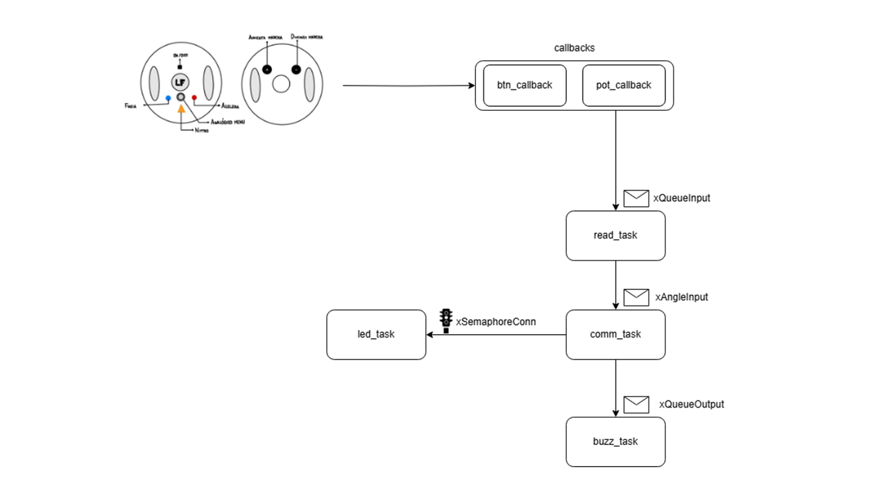
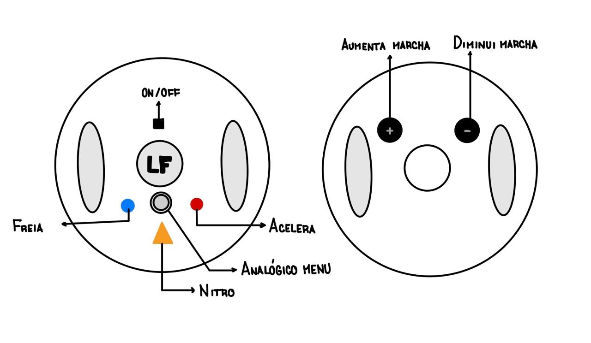

# Controle Customizado para Need for Speed

## Jogo  
**Need for Speed** – série de jogos de corrida em que o jogador compete em alta velocidade com carros customizados em pistas urbanas ou circuitos fechados.

---

## Ideia do Controle  
Um **volante personalizado** sem pedais analógicos.  
A aceleração, o freio normal **e o freio de mão** são botões digitais.  
Novidades desta versão:

- **IMU (MPU-6050)** detecta “tap” / inclinação brusca no eixo Z e envia **ENTER** (confirmar no menu).  
- Botão **Freio de Mão** dedicado (`BREAK_BTN`).  

---

## Entradas (Inputs)

| Tipo | Qtde | Descrição | Mapeamento no Firmware |
|------|------|-----------|------------------------|
| **Eixo analógico – Potenciômetro** | 1 | Ângulo do volante | `WHEEL_PIN` (ADC 2) |
| **Joystick analógico** | 2 eixos | Navegação no menu (X/Y) | `GPx` (ADC 0) / `GPy` (ADC 1) |
| **Botões digitais (GPIO)** | 6 | Acelerar, Frear, **Freio de Mão**, Shift Up, Shift Down, Start | `ACCELERATE_BTN`, `BREAK_BTN`, … |
| **IMU → “Click” virtual** | 1 | Detecção de batida/impulso no eixo Z gera ENTER | `MPU_CLICK_BTN` |

> Valores entre ±30 (const `DEAD_ZONE`) nos eixos analógicos são zerados para evitar ruído (debounce).

---

## Saídas (Outputs)

| Dispositivo | Função |
|-------------|--------|
| **LED** | Indica status de conexão (acende após handshake) |
| **Buzzer** | Feedback sonoro (pulsos ao acelerar, confirmações de comando) |

---

## Protocolo de Comunicação

- **UART-Bluetooth (HC-06)** a `9600 baud`  
  - **Header** `0xAA`, **Footer** `0xFF`  
  - Mensagens: `0x01` (analógico – 3 bytes) / `0x02` (botão – 2 bytes)  
  - **Checksum XOR** do payload para integridade  
- UART-USB opcional (comentada) para debug/fallback  
- **GPIO Interrupts** para todos os botões físicos

---

## Diagrama de Blocos do Firmware

---

## Componentes FreeRTOS

| Categoria | Elementos |
|-----------|-----------|
| **Tasks** | `x_task`, `y_task`, `pot_task` (ADC) • `mpu6050_task` (IMU) • `uart_task` (comunicação) • `buzzer_task` (feedback) |
| **Filas** | `xQueueADC` (ADC → protocolo) • `xQueueInput` (botões / IMU) |
| **Semáforos** | `xCommSemaphore` (conexão ativa) • `xAccelerateSemaphore` (acelerador pressionado) |
| **Interrupts** | `btn_callback` único para todos os GPIOs |

---

## Imagens do Volante

### Proposta Atualizada  

*A alavanca física do freio de mão foi adicionada ao lado direito; LED e buzzer mantêm posição original.*
